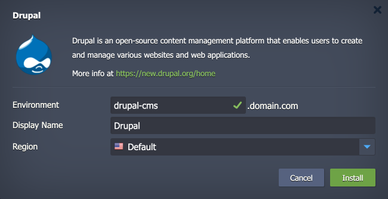

 

# Drupal

The package deploys the [Drupal CMS](https://new.drupal.org/home) solution - an open-source, flexible, and highly scalable content management system that enables users to create and manage various websites and application types.

## Environment Topology

This package creates a dedicated Drupal environment that contains one application server and one database container. It automatically deploys and sets the Drupal application. The automatic vertical scaling is enabled out of the box, and [horizontal scaling](https://www.virtuozzo.com/application-platform-docs/automatic-horizontal-scaling/) can be configured (if needed). The default software stacks utilized in the package are the following:

- Apache 2 PHP application server (PHP 8.3)
- MySQL 8 database
- Drupal 11.0.1

## Deployment to Cloud

To get your Drupal solution, click the "**Deploy to Cloud**" button below, specify your email address within the widget, choose one of the [Virtuozzo Public Cloud Providers](https://www.virtuozzo.com/application-platform-partners/), and confirm by clicking **Install**.

> If you already have a Virtuozzo Application Platform (VAP) account, you can deploy this solution from the [Marketplace](https://www.virtuozzo.com/application-platform-docs/marketplace/) or [import](https://www.virtuozzo.com/application-platform-docs/environment-import/) a manifest file from this repository.

## Installation Process

In the opened installation window at the VAP dashboard, provide a preferred environment and display names, choose a region (if available), and confirm the installation.

Your Drupal application will be automatically installed in a few minutes.
